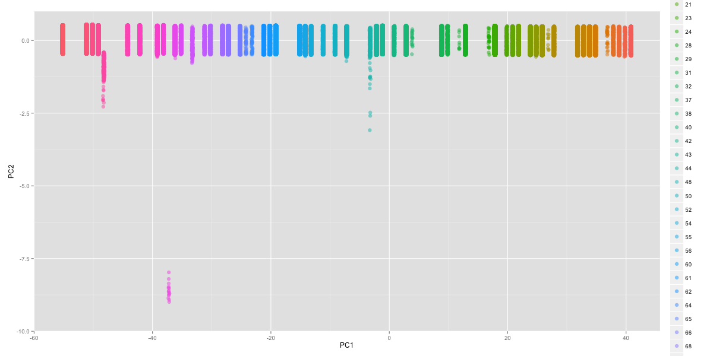

# KDD Cup 99 - PySpark

This is my try with the *KDD Cup of 1999* using Python, Scikit-learn, and Spark.
The dataset for this data mining competition can be found
[here](http://kdd.ics.uci.edu/databases/kddcup99/kddcup99.html).

## Task description summary

You can find the complete description of the task
[here](http://kdd.ics.uci.edu/databases/kddcup99/task.html).

Software to detect network intrusions protects a computer network from
unauthorized users, including perhaps insiders.  The intrusion detector learning
task is to build a predictive model (i.e. a classifier) capable of
distinguishing between *bad connections*, called intrusions or attacks, and
*good normal connections*.

A connection is a sequence of TCP packets starting and ending at some well
defined times, between which data flows to and from a source IP address to a
target IP address under some well defined protocol.  Each connection is labeled
as either normal, or as an attack, with exactly one specific attack type.  Each
connection record consists of about 100 bytes.

Attacks fall into four main categories:

- DOS: denial-of-service, e.g. syn flood;
- R2L: unauthorized access from a remote machine, e.g. guessing password;
- U2R:  unauthorized access to local superuser (root) privileges, e.g., various
``buffer overflow'' attacks;
- probing: surveillance and other probing, e.g., port scanning.

It is important to note that the test data is not from the same probability
distribution as the training data, and it includes specific attack types not in
the training data. This makes the task more realistic. The datasets contain a
total of 24 training attack types, with an additional 14 types in the test data
only.

Some intrusion experts believe that most novel attacks are variants of known
attacks and the "signature" of known attacks can be sufficient to catch novel
variants. Based on this idea, we will experiment with different machine learning
approaches.

## Approach

We will start by working on a reduced dataset (the 10 percent dataset provided).

There we will do some exploratory data analysis using `Pandas`. Then we will
build a classifier using `Scikit-learn`. Our classifier will just classify
entries into `normal` or `attack`. By doing so, we can generalise the model to
new attack types.

However, in our final approach we want to use clustering and anomality
detection. We want our model to be able to work well with unknown attack types
and also to give an approchimation of the closest attack type. Initially we will
do clustering using `Scikit-learn` again and see if we can beat our previous
classifier.

Finally, we will use `Spark` to implement the clustering approach on the
complete dataset containing around 5 million interactions.

## Loading the data

    import pandas
    from time import time
    col_names = ["duration","protocol_type","service","flag","src_bytes",
        "dst_bytes","land","wrong_fragment","urgent","hot","num_failed_logins",
        "logged_in","num_compromised","root_shell","su_attempted","num_root",
        "num_file_creations","num_shells","num_access_files","num_outbound_cmds",
        "is_host_login","is_guest_login","count","srv_count","serror_rate",
        "srv_serror_rate","rerror_rate","srv_rerror_rate","same_srv_rate",
        "diff_srv_rate","srv_diff_host_rate","dst_host_count","dst_host_srv_count",
        "dst_host_same_srv_rate","dst_host_diff_srv_rate","dst_host_same_src_port_rate",
        "dst_host_srv_diff_host_rate","dst_host_serror_rate","dst_host_srv_serror_rate",
        "dst_host_rerror_rate","dst_host_srv_rerror_rate","label"]
    kdd_data_10percent = pandas.read_csv("/nfs/data/KDD99/kddcup.data_10_percent", header=None, names = col_names)
    kdd_data_10percent.describe()

<table border="1" class="dataframe">
  <thead>
    <tr style="text-align: right;">
      <th></th>
      <th>duration</th>
      <th>src_bytes</th>
      <th>dst_bytes</th>
      <th>land</th>
      <th>wrong_fragment</th>
      <th>urgent</th>
      <th>hot</th>
      <th>num_failed_logins</th>
      <th>logged_in</th>
      <th>num_compromised</th>
      <th>...</th>
      <th>dst_host_count</th>
      <th>dst_host_srv_count</th>
      <th>dst_host_same_srv_rate</th>
      <th>dst_host_diff_srv_rate</th>
      <th>dst_host_same_src_port_rate</th>
      <th>dst_host_srv_diff_host_rate</th>
      <th>dst_host_serror_rate</th>
      <th>dst_host_srv_serror_rate</th>
      <th>dst_host_rerror_rate</th>
      <th>dst_host_srv_rerror_rate</th>
    </tr>
  </thead>
  <tbody>
    <tr>
      <th>count</th>
      <td> 494021.000000</td>
      <td> 4.940210e+05</td>
      <td>  494021.000000</td>
      <td> 494021.000000</td>
      <td> 494021.000000</td>
      <td> 494021.000000</td>
      <td> 494021.000000</td>
      <td> 494021.000000</td>
      <td> 494021.000000</td>
      <td> 494021.000000</td>
      <td>...</td>
      <td> 494021.000000</td>
      <td> 494021.000000</td>
      <td> 494021.000000</td>
      <td> 494021.000000</td>
      <td> 494021.000000</td>
      <td> 494021.000000</td>
      <td> 494021.000000</td>
      <td> 494021.000000</td>
      <td> 494021.000000</td>
      <td> 494021.000000</td>
    </tr>
    <tr>
      <th>mean</th>
      <td>     47.979302</td>
      <td> 3.025610e+03</td>
      <td>     868.532425</td>
      <td>      0.000045</td>
      <td>      0.006433</td>
      <td>      0.000014</td>
      <td>      0.034519</td>
      <td>      0.000152</td>
      <td>      0.148247</td>
      <td>      0.010212</td>
      <td>...</td>
      <td>    232.470778</td>
      <td>    188.665670</td>
      <td>      0.753780</td>
      <td>      0.030906</td>
      <td>      0.601935</td>
      <td>      0.006684</td>
      <td>      0.176754</td>
      <td>      0.176443</td>
      <td>      0.058118</td>
      <td>      0.057412</td>
    </tr>
    <tr>
      <th>std</th>
      <td>    707.746472</td>
      <td> 9.882181e+05</td>
      <td>   33040.001252</td>
      <td>      0.006673</td>
      <td>      0.134805</td>
      <td>      0.005510</td>
      <td>      0.782103</td>
      <td>      0.015520</td>
      <td>      0.355345</td>
      <td>      1.798326</td>
      <td>...</td>
      <td>     64.745380</td>
      <td>    106.040437</td>
      <td>      0.410781</td>
      <td>      0.109259</td>
      <td>      0.481309</td>
      <td>      0.042133</td>
      <td>      0.380593</td>
      <td>      0.380919</td>
      <td>      0.230590</td>
      <td>      0.230140</td>
    </tr>
    <tr>
      <th>min</th>
      <td>      0.000000</td>
      <td> 0.000000e+00</td>
      <td>       0.000000</td>
      <td>      0.000000</td>
      <td>      0.000000</td>
      <td>      0.000000</td>
      <td>      0.000000</td>
      <td>      0.000000</td>
      <td>      0.000000</td>
      <td>      0.000000</td>
      <td>...</td>
      <td>      0.000000</td>
      <td>      0.000000</td>
      <td>      0.000000</td>
      <td>      0.000000</td>
      <td>      0.000000</td>
      <td>      0.000000</td>
      <td>      0.000000</td>
      <td>      0.000000</td>
      <td>      0.000000</td>
      <td>      0.000000</td>
    </tr>
    <tr>
      <th>25%</th>
      <td>      0.000000</td>
      <td> 4.500000e+01</td>
      <td>       0.000000</td>
      <td>      0.000000</td>
      <td>      0.000000</td>
      <td>      0.000000</td>
      <td>      0.000000</td>
      <td>      0.000000</td>
      <td>      0.000000</td>
      <td>      0.000000</td>
      <td>...</td>
      <td>    255.000000</td>
      <td>     46.000000</td>
      <td>      0.410000</td>
      <td>      0.000000</td>
      <td>      0.000000</td>
      <td>      0.000000</td>
      <td>      0.000000</td>
      <td>      0.000000</td>
      <td>      0.000000</td>
      <td>      0.000000</td>
    </tr>
    <tr>
      <th>50%</th>
      <td>      0.000000</td>
      <td> 5.200000e+02</td>
      <td>       0.000000</td>
      <td>      0.000000</td>
      <td>      0.000000</td>
      <td>      0.000000</td>
      <td>      0.000000</td>
      <td>      0.000000</td>
      <td>      0.000000</td>
      <td>      0.000000</td>
      <td>...</td>
      <td>    255.000000</td>
      <td>    255.000000</td>
      <td>      1.000000</td>
      <td>      0.000000</td>
      <td>      1.000000</td>
      <td>      0.000000</td>
      <td>      0.000000</td>
      <td>      0.000000</td>
      <td>      0.000000</td>
      <td>      0.000000</td>
    </tr>
    <tr>
      <th>75%</th>
      <td>      0.000000</td>
      <td> 1.032000e+03</td>
      <td>       0.000000</td>
      <td>      0.000000</td>
      <td>      0.000000</td>
      <td>      0.000000</td>
      <td>      0.000000</td>
      <td>      0.000000</td>
      <td>      0.000000</td>
      <td>      0.000000</td>
      <td>...</td>
      <td>    255.000000</td>
      <td>    255.000000</td>
      <td>      1.000000</td>
      <td>      0.040000</td>
      <td>      1.000000</td>
      <td>      0.000000</td>
      <td>      0.000000</td>
      <td>      0.000000</td>
      <td>      0.000000</td>
      <td>      0.000000</td>
    </tr>
    <tr>
      <th>max</th>
      <td>  58329.000000</td>
      <td> 6.933756e+08</td>
      <td> 5155468.000000</td>
      <td>      1.000000</td>
      <td>      3.000000</td>
      <td>      3.000000</td>
      <td>     30.000000</td>
      <td>      5.000000</td>
      <td>      1.000000</td>
      <td>    884.000000</td>
      <td>...</td>
      <td>    255.000000</td>
      <td>    255.000000</td>
      <td>      1.000000</td>
      <td>      1.000000</td>
      <td>      1.000000</td>
      <td>      1.000000</td>
      <td>      1.000000</td>
      <td>      1.000000</td>
      <td>      1.000000</td>
      <td>      1.000000</td>
    </tr>
  </tbody>
</table>

8 rows × 38 columns

Now we have our data loaded into a `Pandas` data frame. In order to get familiar
with our data, let's have a look at how the labels are distributed.

    kdd_data_10percent['label'].value_counts()

    smurf.              280790
    neptune.            107201
    normal.              97278
    back.                 2203
    satan.                1589
    ipsweep.              1247
    portsweep.            1040
    warezclient.          1020
    teardrop.              979
    pod.                   264
    nmap.                  231
    guess_passwd.           53
    buffer_overflow.        30
    land.                   21
    warezmaster.            20
    imap.                   12
    rootkit.                10
    loadmodule.              9
    ftp_write.               8
    multihop.                7
    phf.                     4
    perl.                    3
    spy.                     2
    dtype: int64

## Feature selection

Initially, we will use all features. We need to do something with our
categorical variables. For now, we will not include them in the training
features.

    num_features = [
        "duration","src_bytes",
        "dst_bytes","land","wrong_fragment","urgent","hot","num_failed_logins",
        "logged_in","num_compromised","root_shell","su_attempted","num_root",
        "num_file_creations","num_shells","num_access_files","num_outbound_cmds",
        "is_host_login","is_guest_login","count","srv_count","serror_rate",
        "srv_serror_rate","rerror_rate","srv_rerror_rate","same_srv_rate",
        "diff_srv_rate","srv_diff_host_rate","dst_host_count","dst_host_srv_count",
        "dst_host_same_srv_rate","dst_host_diff_srv_rate","dst_host_same_src_port_rate",
        "dst_host_srv_diff_host_rate","dst_host_serror_rate","dst_host_srv_serror_rate",
        "dst_host_rerror_rate","dst_host_srv_rerror_rate"
    ]
    features = kdd_data_10percent[num_features].astype(float)
    features.describe()

<table border="1" class="dataframe">
  <thead>
    <tr style="text-align: right;">
      <th></th>
      <th>duration</th>
      <th>src_bytes</th>
      <th>dst_bytes</th>
      <th>land</th>
      <th>wrong_fragment</th>
      <th>urgent</th>
      <th>hot</th>
      <th>num_failed_logins</th>
      <th>logged_in</th>
      <th>num_compromised</th>
      <th>...</th>
      <th>dst_host_count</th>
      <th>dst_host_srv_count</th>
      <th>dst_host_same_srv_rate</th>
      <th>dst_host_diff_srv_rate</th>
      <th>dst_host_same_src_port_rate</th>
      <th>dst_host_srv_diff_host_rate</th>
      <th>dst_host_serror_rate</th>
      <th>dst_host_srv_serror_rate</th>
      <th>dst_host_rerror_rate</th>
      <th>dst_host_srv_rerror_rate</th>
    </tr>
  </thead>
  <tbody>
    <tr>
      <th>count</th>
      <td> 494021.000000</td>
      <td> 4.940210e+05</td>
      <td>  494021.000000</td>
      <td> 494021.000000</td>
      <td> 494021.000000</td>
      <td> 494021.000000</td>
      <td> 494021.000000</td>
      <td> 494021.000000</td>
      <td> 494021.000000</td>
      <td> 494021.000000</td>
      <td>...</td>
      <td> 494021.000000</td>
      <td> 494021.000000</td>
      <td> 494021.000000</td>
      <td> 494021.000000</td>
      <td> 494021.000000</td>
      <td> 494021.000000</td>
      <td> 494021.000000</td>
      <td> 494021.000000</td>
      <td> 494021.000000</td>
      <td> 494021.000000</td>
    </tr>
    <tr>
      <th>mean</th>
      <td>     47.979302</td>
      <td> 3.025610e+03</td>
      <td>     868.532425</td>
      <td>      0.000045</td>
      <td>      0.006433</td>
      <td>      0.000014</td>
      <td>      0.034519</td>
      <td>      0.000152</td>
      <td>      0.148247</td>
      <td>      0.010212</td>
      <td>...</td>
      <td>    232.470778</td>
      <td>    188.665670</td>
      <td>      0.753780</td>
      <td>      0.030906</td>
      <td>      0.601935</td>
      <td>      0.006684</td>
      <td>      0.176754</td>
      <td>      0.176443</td>
      <td>      0.058118</td>
      <td>      0.057412</td>
    </tr>
    <tr>
      <th>std</th>
      <td>    707.746472</td>
      <td> 9.882181e+05</td>
      <td>   33040.001252</td>
      <td>      0.006673</td>
      <td>      0.134805</td>
      <td>      0.005510</td>
      <td>      0.782103</td>
      <td>      0.015520</td>
      <td>      0.355345</td>
      <td>      1.798326</td>
      <td>...</td>
      <td>     64.745380</td>
      <td>    106.040437</td>
      <td>      0.410781</td>
      <td>      0.109259</td>
      <td>      0.481309</td>
      <td>      0.042133</td>
      <td>      0.380593</td>
      <td>      0.380919</td>
      <td>      0.230590</td>
      <td>      0.230140</td>
    </tr>
    <tr>
      <th>min</th>
      <td>      0.000000</td>
      <td> 0.000000e+00</td>
      <td>       0.000000</td>
      <td>      0.000000</td>
      <td>      0.000000</td>
      <td>      0.000000</td>
      <td>      0.000000</td>
      <td>      0.000000</td>
      <td>      0.000000</td>
      <td>      0.000000</td>
      <td>...</td>
      <td>      0.000000</td>
      <td>      0.000000</td>
      <td>      0.000000</td>
      <td>      0.000000</td>
      <td>      0.000000</td>
      <td>      0.000000</td>
      <td>      0.000000</td>
      <td>      0.000000</td>
      <td>      0.000000</td>
      <td>      0.000000</td>
    </tr>
    <tr>
      <th>25%</th>
      <td>      0.000000</td>
      <td> 4.500000e+01</td>
      <td>       0.000000</td>
      <td>      0.000000</td>
      <td>      0.000000</td>
      <td>      0.000000</td>
      <td>      0.000000</td>
      <td>      0.000000</td>
      <td>      0.000000</td>
      <td>      0.000000</td>
      <td>...</td>
      <td>    255.000000</td>
      <td>     46.000000</td>
      <td>      0.410000</td>
      <td>      0.000000</td>
      <td>      0.000000</td>
      <td>      0.000000</td>
      <td>      0.000000</td>
      <td>      0.000000</td>
      <td>      0.000000</td>
      <td>      0.000000</td>
    </tr>
    <tr>
      <th>50%</th>
      <td>      0.000000</td>
      <td> 5.200000e+02</td>
      <td>       0.000000</td>
      <td>      0.000000</td>
      <td>      0.000000</td>
      <td>      0.000000</td>
      <td>      0.000000</td>
      <td>      0.000000</td>
      <td>      0.000000</td>
      <td>      0.000000</td>
      <td>...</td>
      <td>    255.000000</td>
      <td>    255.000000</td>
      <td>      1.000000</td>
      <td>      0.000000</td>
      <td>      1.000000</td>
      <td>      0.000000</td>
      <td>      0.000000</td>
      <td>      0.000000</td>
      <td>      0.000000</td>
      <td>      0.000000</td>
    </tr>
    <tr>
      <th>75%</th>
      <td>      0.000000</td>
      <td> 1.032000e+03</td>
      <td>       0.000000</td>
      <td>      0.000000</td>
      <td>      0.000000</td>
      <td>      0.000000</td>
      <td>      0.000000</td>
      <td>      0.000000</td>
      <td>      0.000000</td>
      <td>      0.000000</td>
      <td>...</td>
      <td>    255.000000</td>
      <td>    255.000000</td>
      <td>      1.000000</td>
      <td>      0.040000</td>
      <td>      1.000000</td>
      <td>      0.000000</td>
      <td>      0.000000</td>
      <td>      0.000000</td>
      <td>      0.000000</td>
      <td>      0.000000</td>
    </tr>
    <tr>
      <th>max</th>
      <td>  58329.000000</td>
      <td> 6.933756e+08</td>
      <td> 5155468.000000</td>
      <td>      1.000000</td>
      <td>      3.000000</td>
      <td>      3.000000</td>
      <td>     30.000000</td>
      <td>      5.000000</td>
      <td>      1.000000</td>
      <td>    884.000000</td>
      <td>...</td>
      <td>    255.000000</td>
      <td>    255.000000</td>
      <td>      1.000000</td>
      <td>      1.000000</td>
      <td>      1.000000</td>
      <td>      1.000000</td>
      <td>      1.000000</td>
      <td>      1.000000</td>
      <td>      1.000000</td>
      <td>      1.000000</td>
    </tr>
  </tbody>
</table>

8 rows × 38 columns

As we mentioned, we are going to reduce the outputs to `normal` and `attack`.

    from sklearn.neighbors import KNeighborsClassifier
    labels = kdd_data_10percent['label'].copy()
    labels[labels!='normal.'] = 'attack.'
    labels.value_counts()

    attack.    396743
    normal.     97278
    dtype: int64

## Feature scaling

We are going to use a lot of distance-based methods here. In order to avoid some
features distances dominate others, we need to scale all of them.

    from sklearn.preprocessing import MinMaxScaler
    features.apply(lambda x: MinMaxScaler().fit_transform(x))
    features.describe()

<table border="1" class="dataframe">
  <thead>
    <tr style="text-align: right;">
      <th></th>
      <th>duration</th>
      <th>src_bytes</th>
      <th>dst_bytes</th>
      <th>land</th>
      <th>wrong_fragment</th>
      <th>urgent</th>
      <th>hot</th>
      <th>num_failed_logins</th>
      <th>logged_in</th>
      <th>num_compromised</th>
      <th>...</th>
      <th>dst_host_count</th>
      <th>dst_host_srv_count</th>
      <th>dst_host_same_srv_rate</th>
      <th>dst_host_diff_srv_rate</th>
      <th>dst_host_same_src_port_rate</th>
      <th>dst_host_srv_diff_host_rate</th>
      <th>dst_host_serror_rate</th>
      <th>dst_host_srv_serror_rate</th>
      <th>dst_host_rerror_rate</th>
      <th>dst_host_srv_rerror_rate</th>
    </tr>
  </thead>
  <tbody>
    <tr>
      <th>count</th>
      <td> 494021.000000</td>
      <td> 4.940210e+05</td>
      <td> 494021.000000</td>
      <td> 494021.000000</td>
      <td> 494021.000000</td>
      <td> 494021.000000</td>
      <td> 494021.000000</td>
      <td> 494021.000000</td>
      <td> 494021.000000</td>
      <td> 494021.000000</td>
      <td>...</td>
      <td> 494021.000000</td>
      <td> 494021.000000</td>
      <td> 494021.000000</td>
      <td> 494021.000000</td>
      <td> 494021.000000</td>
      <td> 494021.000000</td>
      <td> 494021.000000</td>
      <td> 494021.000000</td>
      <td> 494021.000000</td>
      <td> 494021.000000</td>
    </tr>
    <tr>
      <th>mean</th>
      <td>      0.000823</td>
      <td> 4.363595e-06</td>
      <td>      0.000168</td>
      <td>      0.000045</td>
      <td>      0.002144</td>
      <td>      0.000005</td>
      <td>      0.001151</td>
      <td>      0.000030</td>
      <td>      0.148247</td>
      <td>      0.000012</td>
      <td>...</td>
      <td>      0.911650</td>
      <td>      0.739865</td>
      <td>      0.753780</td>
      <td>      0.030906</td>
      <td>      0.601935</td>
      <td>      0.006684</td>
      <td>      0.176754</td>
      <td>      0.176443</td>
      <td>      0.058118</td>
      <td>      0.057412</td>
    </tr>
    <tr>
      <th>std</th>
      <td>      0.012134</td>
      <td> 1.425228e-03</td>
      <td>      0.006409</td>
      <td>      0.006673</td>
      <td>      0.044935</td>
      <td>      0.001837</td>
      <td>      0.026070</td>
      <td>      0.003104</td>
      <td>      0.355345</td>
      <td>      0.002034</td>
      <td>...</td>
      <td>      0.253903</td>
      <td>      0.415845</td>
      <td>      0.410781</td>
      <td>      0.109259</td>
      <td>      0.481309</td>
      <td>      0.042133</td>
      <td>      0.380593</td>
      <td>      0.380919</td>
      <td>      0.230590</td>
      <td>      0.230140</td>
    </tr>
    <tr>
      <th>min</th>
      <td>      0.000000</td>
      <td> 0.000000e+00</td>
      <td>      0.000000</td>
      <td>      0.000000</td>
      <td>      0.000000</td>
      <td>      0.000000</td>
      <td>      0.000000</td>
      <td>      0.000000</td>
      <td>      0.000000</td>
      <td>      0.000000</td>
      <td>...</td>
      <td>      0.000000</td>
      <td>      0.000000</td>
      <td>      0.000000</td>
      <td>      0.000000</td>
      <td>      0.000000</td>
      <td>      0.000000</td>
      <td>      0.000000</td>
      <td>      0.000000</td>
      <td>      0.000000</td>
      <td>      0.000000</td>
    </tr>
    <tr>
      <th>25%</th>
      <td>      0.000000</td>
      <td> 6.489989e-08</td>
      <td>      0.000000</td>
      <td>      0.000000</td>
      <td>      0.000000</td>
      <td>      0.000000</td>
      <td>      0.000000</td>
      <td>      0.000000</td>
      <td>      0.000000</td>
      <td>      0.000000</td>
      <td>...</td>
      <td>      1.000000</td>
      <td>      0.180392</td>
      <td>      0.410000</td>
      <td>      0.000000</td>
      <td>      0.000000</td>
      <td>      0.000000</td>
      <td>      0.000000</td>
      <td>      0.000000</td>
      <td>      0.000000</td>
      <td>      0.000000</td>
    </tr>
    <tr>
      <th>50%</th>
      <td>      0.000000</td>
      <td> 7.499542e-07</td>
      <td>      0.000000</td>
      <td>      0.000000</td>
      <td>      0.000000</td>
      <td>      0.000000</td>
      <td>      0.000000</td>
      <td>      0.000000</td>
      <td>      0.000000</td>
      <td>      0.000000</td>
      <td>...</td>
      <td>      1.000000</td>
      <td>      1.000000</td>
      <td>      1.000000</td>
      <td>      0.000000</td>
      <td>      1.000000</td>
      <td>      0.000000</td>
      <td>      0.000000</td>
      <td>      0.000000</td>
      <td>      0.000000</td>
      <td>      0.000000</td>
    </tr>
    <tr>
      <th>75%</th>
      <td>      0.000000</td>
      <td> 1.488371e-06</td>
      <td>      0.000000</td>
      <td>      0.000000</td>
      <td>      0.000000</td>
      <td>      0.000000</td>
      <td>      0.000000</td>
      <td>      0.000000</td>
      <td>      0.000000</td>
      <td>      0.000000</td>
      <td>...</td>
      <td>      1.000000</td>
      <td>      1.000000</td>
      <td>      1.000000</td>
      <td>      0.040000</td>
      <td>      1.000000</td>
      <td>      0.000000</td>
      <td>      0.000000</td>
      <td>      0.000000</td>
      <td>      0.000000</td>
      <td>      0.000000</td>
    </tr>
    <tr>
      <th>max</th>
      <td>      1.000000</td>
      <td> 1.000000e+00</td>
      <td>      1.000000</td>
      <td>      1.000000</td>
      <td>      1.000000</td>
      <td>      1.000000</td>
      <td>      1.000000</td>
      <td>      1.000000</td>
      <td>      1.000000</td>
      <td>      1.000000</td>
      <td>...</td>
      <td>      1.000000</td>
      <td>      1.000000</td>
      <td>      1.000000</td>
      <td>      1.000000</td>
      <td>      1.000000</td>
      <td>      1.000000</td>
      <td>      1.000000</td>
      <td>      1.000000</td>
      <td>      1.000000</td>
      <td>      1.000000</td>
    </tr>
  </tbody>
</table>

8 rows × 38 columns

## Visualising data using Principal Components

By using Principal Component Analysis, we can reduce the dimensionality of our
data and plot it into a two-dimensional space. The PCA will capture those
dimensions with the maximum variance, reducing the information loss.

    # TODO

## Training a classifier

Following the idea that new attack types will be similar to known types, let's
start by trying a k-nearest neighbours classifier. We must to avoid brute force
comparisons in the Nxd space at all costs. Being N the number of samples in our
data more than 400K, and d the number of features 38, we will end up with an
unfeasible modeling process. For this reason we pass `algorithm = 'ball_tree'`.
For more on kNN performance, check [here](http://scikit-
learn.org/stable/modules/neighbors.html#choice-of-nearest-neighbors-algorithm).

    clf = KNeighborsClassifier(n_neighbors = 5, algorithm = 'ball_tree', leaf_size=500)
    t0 = time()
    clf.fit(features,labels)
    tt = time()-t0
    print "Classifier trained in {} seconds".format(round(tt,3))

    Classifier trained in 2405.17 seconds

Now let's try the classifier with the testing data. First we need to load the
labeled test data. We wil also sample 10 percent of the entries. For that. we
will take advantage of the `train_test_split` function in `sklearn`.

    kdd_data_corrected = pandas.read_csv("/nfs/data/KDD99/corrected", header=None, names = col_names)
    kdd_data_corrected['label'].value_counts()

    smurf.              164091
    normal.              60593
    neptune.             58001
    snmpgetattack.        7741
    mailbomb.             5000
    guess_passwd.         4367
    snmpguess.            2406
    satan.                1633
    warezmaster.          1602
    back.                 1098
    mscan.                1053
    apache2.               794
    processtable.          759
    saint.                 736
    portsweep.             354
    ipsweep.               306
    httptunnel.            158
    pod.                    87
    nmap.                   84
    buffer_overflow.        22
    multihop.               18
    named.                  17
    sendmail.               17
    ps.                     16
    xterm.                  13
    rootkit.                13
    teardrop.               12
    xlock.                   9
    land.                    9
    xsnoop.                  4
    ftp_write.               3
    sqlattack.               2
    loadmodule.              2
    worm.                    2
    perl.                    2
    phf.                     2
    udpstorm.                2
    imap.                    1
    dtype: int64

We can see that we have new attack labels. In any case, we will convert all of
the to the `attack.` label.

    kdd_data_corrected['label'][kdd_data_corrected['label']!='normal.'] = 'attack.'
    kdd_data_corrected['label'].value_counts()

    attack.    250436
    normal.     60593
    dtype: int64

Again we select features and scale.

    from sklearn.cross_validation import train_test_split
    kdd_data_corrected[num_features] = kdd_data_corrected[num_features].astype(float)
    kdd_data_corrected[num_features].apply(lambda x: MinMaxScaler().fit_transform(x))

<table border="1" class="dataframe">
  <thead>
    <tr style="text-align: right;">
      <th></th>
      <th>duration</th>
      <th>src_bytes</th>
      <th>dst_bytes</th>
      <th>land</th>
      <th>wrong_fragment</th>
      <th>urgent</th>
      <th>hot</th>
      <th>num_failed_logins</th>
      <th>logged_in</th>
      <th>num_compromised</th>
      <th>...</th>
      <th>dst_host_count</th>
      <th>dst_host_srv_count</th>
      <th>dst_host_same_srv_rate</th>
      <th>dst_host_diff_srv_rate</th>
      <th>dst_host_same_src_port_rate</th>
      <th>dst_host_srv_diff_host_rate</th>
      <th>dst_host_serror_rate</th>
      <th>dst_host_srv_serror_rate</th>
      <th>dst_host_rerror_rate</th>
      <th>dst_host_srv_rerror_rate</th>
    </tr>
  </thead>
  <tbody>
    <tr>
      <th>0     </th>
      <td> 0.000000</td>
      <td> 0.000002</td>
      <td> 0.000028</td>
      <td> 0</td>
      <td> 0</td>
      <td> 0</td>
      <td> 0</td>
      <td> 0</td>
      <td> 0</td>
      <td> 0</td>
      <td>...</td>
      <td> 1.000000</td>
      <td> 0.996078</td>
      <td> 1.00</td>
      <td> 0.01</td>
      <td> 0.00</td>
      <td> 0.00</td>
      <td> 0.00</td>
      <td> 0</td>
      <td> 0.00</td>
      <td> 0.00</td>
    </tr>
    <tr>
      <th>1     </th>
      <td> 0.000000</td>
      <td> 0.000002</td>
      <td> 0.000028</td>
      <td> 0</td>
      <td> 0</td>
      <td> 0</td>
      <td> 0</td>
      <td> 0</td>
      <td> 0</td>
      <td> 0</td>
      <td>...</td>
      <td> 1.000000</td>
      <td> 0.996078</td>
      <td> 1.00</td>
      <td> 0.01</td>
      <td> 0.00</td>
      <td> 0.00</td>
      <td> 0.00</td>
      <td> 0</td>
      <td> 0.00</td>
      <td> 0.00</td>
    </tr>
    <tr>
      <th>2     </th>
      <td> 0.000000</td>
      <td> 0.000002</td>
      <td> 0.000028</td>
      <td> 0</td>
      <td> 0</td>
      <td> 0</td>
      <td> 0</td>
      <td> 0</td>
      <td> 0</td>
      <td> 0</td>
      <td>...</td>
      <td> 1.000000</td>
      <td> 0.996078</td>
      <td> 1.00</td>
      <td> 0.01</td>
      <td> 0.00</td>
      <td> 0.00</td>
      <td> 0.00</td>
      <td> 0</td>
      <td> 0.00</td>
      <td> 0.00</td>
    </tr>
    <tr>
      <th>3     </th>
      <td> 0.000000</td>
      <td> 0.000002</td>
      <td> 0.000028</td>
      <td> 0</td>
      <td> 0</td>
      <td> 0</td>
      <td> 0</td>
      <td> 0</td>
      <td> 0</td>
      <td> 0</td>
      <td>...</td>
      <td> 1.000000</td>
      <td> 0.996078</td>
      <td> 1.00</td>
      <td> 0.01</td>
      <td> 0.00</td>
      <td> 0.00</td>
      <td> 0.00</td>
      <td> 0</td>
      <td> 0.00</td>
      <td> 0.00</td>
    </tr>
    <tr>
      <th>4     </th>
      <td> 0.000000</td>
      <td> 0.000002</td>
      <td> 0.000028</td>
      <td> 0</td>
      <td> 0</td>
      <td> 0</td>
      <td> 0</td>
      <td> 0</td>
      <td> 0</td>
      <td> 0</td>
      <td>...</td>
      <td> 1.000000</td>
      <td> 0.996078</td>
      <td> 1.00</td>
      <td> 0.01</td>
      <td> 0.01</td>
      <td> 0.00</td>
      <td> 0.00</td>
      <td> 0</td>
      <td> 0.00</td>
      <td> 0.00</td>
    </tr>
    <tr>
      <th>5     </th>
      <td> 0.000000</td>
      <td> 0.000002</td>
      <td> 0.000028</td>
      <td> 0</td>
      <td> 0</td>
      <td> 0</td>
      <td> 0</td>
      <td> 0</td>
      <td> 0</td>
      <td> 0</td>
      <td>...</td>
      <td> 1.000000</td>
      <td> 1.000000</td>
      <td> 1.00</td>
      <td> 0.00</td>
      <td> 0.01</td>
      <td> 0.00</td>
      <td> 0.00</td>
      <td> 0</td>
      <td> 0.00</td>
      <td> 0.00</td>
    </tr>
    <tr>
      <th>6     </th>
      <td> 0.000000</td>
      <td> 0.000000</td>
      <td> 0.000000</td>
      <td> 0</td>
      <td> 0</td>
      <td> 0</td>
      <td> 0</td>
      <td> 0</td>
      <td> 0</td>
      <td> 0</td>
      <td>...</td>
      <td> 0.039216</td>
      <td> 0.011765</td>
      <td> 0.30</td>
      <td> 0.30</td>
      <td> 0.30</td>
      <td> 0.00</td>
      <td> 0.00</td>
      <td> 0</td>
      <td> 0.00</td>
      <td> 0.00</td>
    </tr>
    <tr>
      <th>7     </th>
      <td> 0.000000</td>
      <td> 0.000002</td>
      <td> 0.000028</td>
      <td> 0</td>
      <td> 0</td>
      <td> 0</td>
      <td> 0</td>
      <td> 0</td>
      <td> 0</td>
      <td> 0</td>
      <td>...</td>
      <td> 1.000000</td>
      <td> 0.992157</td>
      <td> 0.99</td>
      <td> 0.01</td>
      <td> 0.00</td>
      <td> 0.00</td>
      <td> 0.00</td>
      <td> 0</td>
      <td> 0.00</td>
      <td> 0.00</td>
    </tr>
    <tr>
      <th>8     </th>
      <td> 0.000000</td>
      <td> 0.000002</td>
      <td> 0.000028</td>
      <td> 0</td>
      <td> 0</td>
      <td> 0</td>
      <td> 0</td>
      <td> 0</td>
      <td> 0</td>
      <td> 0</td>
      <td>...</td>
      <td> 1.000000</td>
      <td> 0.996078</td>
      <td> 1.00</td>
      <td> 0.01</td>
      <td> 0.00</td>
      <td> 0.00</td>
      <td> 0.00</td>
      <td> 0</td>
      <td> 0.00</td>
      <td> 0.00</td>
    </tr>
    <tr>
      <th>9     </th>
      <td> 0.000000</td>
      <td> 0.000004</td>
      <td> 0.000036</td>
      <td> 0</td>
      <td> 0</td>
      <td> 0</td>
      <td> 0</td>
      <td> 0</td>
      <td> 1</td>
      <td> 0</td>
      <td>...</td>
      <td> 0.278431</td>
      <td> 1.000000</td>
      <td> 1.00</td>
      <td> 0.00</td>
      <td> 0.01</td>
      <td> 0.01</td>
      <td> 0.00</td>
      <td> 0</td>
      <td> 0.00</td>
      <td> 0.00</td>
    </tr>
    <tr>
      <th>10    </th>
      <td> 0.000000</td>
      <td> 0.000002</td>
      <td> 0.000028</td>
      <td> 0</td>
      <td> 0</td>
      <td> 0</td>
      <td> 0</td>
      <td> 0</td>
      <td> 0</td>
      <td> 0</td>
      <td>...</td>
      <td> 1.000000</td>
      <td> 0.996078</td>
      <td> 1.00</td>
      <td> 0.01</td>
      <td> 0.00</td>
      <td> 0.00</td>
      <td> 0.00</td>
      <td> 0</td>
      <td> 0.00</td>
      <td> 0.00</td>
    </tr>
    <tr>
      <th>11    </th>
      <td> 0.000000</td>
      <td> 0.000004</td>
      <td> 0.000050</td>
      <td> 0</td>
      <td> 0</td>
      <td> 0</td>
      <td> 0</td>
      <td> 0</td>
      <td> 1</td>
      <td> 0</td>
      <td>...</td>
      <td> 0.011765</td>
      <td> 1.000000</td>
      <td> 1.00</td>
      <td> 0.00</td>
      <td> 0.33</td>
      <td> 0.07</td>
      <td> 0.33</td>
      <td> 0</td>
      <td> 0.00</td>
      <td> 0.00</td>
    </tr>
    <tr>
      <th>12    </th>
      <td> 0.000000</td>
      <td> 0.000002</td>
      <td> 0.000028</td>
      <td> 0</td>
      <td> 0</td>
      <td> 0</td>
      <td> 0</td>
      <td> 0</td>
      <td> 0</td>
      <td> 0</td>
      <td>...</td>
      <td> 1.000000</td>
      <td> 0.996078</td>
      <td> 1.00</td>
      <td> 0.01</td>
      <td> 0.01</td>
      <td> 0.00</td>
      <td> 0.00</td>
      <td> 0</td>
      <td> 0.00</td>
      <td> 0.00</td>
    </tr>
    <tr>
      <th>13    </th>
      <td> 0.000000</td>
      <td> 0.000002</td>
      <td> 0.000028</td>
      <td> 0</td>
      <td> 0</td>
      <td> 0</td>
      <td> 0</td>
      <td> 0</td>
      <td> 0</td>
      <td> 0</td>
      <td>...</td>
      <td> 1.000000</td>
      <td> 0.988235</td>
      <td> 0.99</td>
      <td> 0.01</td>
      <td> 0.00</td>
      <td> 0.00</td>
      <td> 0.00</td>
      <td> 0</td>
      <td> 0.00</td>
      <td> 0.00</td>
    </tr>
    <tr>
      <th>14    </th>
      <td> 0.000017</td>
      <td> 0.000050</td>
      <td> 0.000063</td>
      <td> 0</td>
      <td> 0</td>
      <td> 0</td>
      <td> 0</td>
      <td> 0</td>
      <td> 1</td>
      <td> 0</td>
      <td>...</td>
      <td> 0.211765</td>
      <td> 0.152941</td>
      <td> 0.72</td>
      <td> 0.11</td>
      <td> 0.02</td>
      <td> 0.00</td>
      <td> 0.02</td>
      <td> 0</td>
      <td> 0.09</td>
      <td> 0.13</td>
    </tr>
    <tr>
      <th>15    </th>
      <td> 0.000000</td>
      <td> 0.000005</td>
      <td> 0.002650</td>
      <td> 0</td>
      <td> 0</td>
      <td> 0</td>
      <td> 0</td>
      <td> 0</td>
      <td> 1</td>
      <td> 0</td>
      <td>...</td>
      <td> 0.694118</td>
      <td> 1.000000</td>
      <td> 1.00</td>
      <td> 0.00</td>
      <td> 0.01</td>
      <td> 0.01</td>
      <td> 0.00</td>
      <td> 0</td>
      <td> 0.00</td>
      <td> 0.00</td>
    </tr>
    <tr>
      <th>16    </th>
      <td> 0.000000</td>
      <td> 0.000005</td>
      <td> 0.000681</td>
      <td> 0</td>
      <td> 0</td>
      <td> 0</td>
      <td> 0</td>
      <td> 0</td>
      <td> 1</td>
      <td> 0</td>
      <td>...</td>
      <td> 0.733333</td>
      <td> 1.000000</td>
      <td> 1.00</td>
      <td> 0.00</td>
      <td> 0.01</td>
      <td> 0.01</td>
      <td> 0.00</td>
      <td> 0</td>
      <td> 0.00</td>
      <td> 0.00</td>
    </tr>
    <tr>
      <th>17    </th>
      <td> 0.000000</td>
      <td> 0.000005</td>
      <td> 0.000145</td>
      <td> 0</td>
      <td> 0</td>
      <td> 0</td>
      <td> 0</td>
      <td> 0</td>
      <td> 1</td>
      <td> 0</td>
      <td>...</td>
      <td> 0.768627</td>
      <td> 1.000000</td>
      <td> 1.00</td>
      <td> 0.00</td>
      <td> 0.01</td>
      <td> 0.01</td>
      <td> 0.00</td>
      <td> 0</td>
      <td> 0.00</td>
      <td> 0.00</td>
    </tr>
    <tr>
      <th>18    </th>
      <td> 0.000000</td>
      <td> 0.000002</td>
      <td> 0.000028</td>
      <td> 0</td>
      <td> 0</td>
      <td> 0</td>
      <td> 0</td>
      <td> 0</td>
      <td> 0</td>
      <td> 0</td>
      <td>...</td>
      <td> 1.000000</td>
      <td> 0.996078</td>
      <td> 1.00</td>
      <td> 0.01</td>
      <td> 0.01</td>
      <td> 0.00</td>
      <td> 0.00</td>
      <td> 0</td>
      <td> 0.00</td>
      <td> 0.00</td>
    </tr>
    <tr>
      <th>19    </th>
      <td> 0.000000</td>
      <td> 0.000002</td>
      <td> 0.000028</td>
      <td> 0</td>
      <td> 0</td>
      <td> 0</td>
      <td> 0</td>
      <td> 0</td>
      <td> 0</td>
      <td> 0</td>
      <td>...</td>
      <td> 1.000000</td>
      <td> 0.996078</td>
      <td> 1.00</td>
      <td> 0.01</td>
      <td> 0.00</td>
      <td> 0.00</td>
      <td> 0.00</td>
      <td> 0</td>
      <td> 0.00</td>
      <td> 0.00</td>
    </tr>
    <tr>
      <th>20    </th>
      <td> 0.000000</td>
      <td> 0.000004</td>
      <td> 0.001775</td>
      <td> 0</td>
      <td> 0</td>
      <td> 0</td>
      <td> 0</td>
      <td> 0</td>
      <td> 1</td>
      <td> 0</td>
      <td>...</td>
      <td> 0.227451</td>
      <td> 1.000000</td>
      <td> 1.00</td>
      <td> 0.00</td>
      <td> 0.02</td>
      <td> 0.05</td>
      <td> 0.00</td>
      <td> 0</td>
      <td> 0.00</td>
      <td> 0.00</td>
    </tr>
    <tr>
      <th>21    </th>
      <td> 0.000000</td>
      <td> 0.000002</td>
      <td> 0.000028</td>
      <td> 0</td>
      <td> 0</td>
      <td> 0</td>
      <td> 0</td>
      <td> 0</td>
      <td> 0</td>
      <td> 0</td>
      <td>...</td>
      <td> 1.000000</td>
      <td> 0.992157</td>
      <td> 0.99</td>
      <td> 0.01</td>
      <td> 0.00</td>
      <td> 0.00</td>
      <td> 0.00</td>
      <td> 0</td>
      <td> 0.00</td>
      <td> 0.00</td>
    </tr>
    <tr>
      <th>22    </th>
      <td> 0.000000</td>
      <td> 0.000004</td>
      <td> 0.000036</td>
      <td> 0</td>
      <td> 0</td>
      <td> 0</td>
      <td> 0</td>
      <td> 0</td>
      <td> 1</td>
      <td> 0</td>
      <td>...</td>
      <td> 1.000000</td>
      <td> 1.000000</td>
      <td> 1.00</td>
      <td> 0.00</td>
      <td> 0.00</td>
      <td> 0.00</td>
      <td> 0.00</td>
      <td> 0</td>
      <td> 0.00</td>
      <td> 0.00</td>
    </tr>
    <tr>
      <th>23    </th>
      <td> 0.000000</td>
      <td> 0.000004</td>
      <td> 0.001699</td>
      <td> 0</td>
      <td> 0</td>
      <td> 0</td>
      <td> 0</td>
      <td> 0</td>
      <td> 1</td>
      <td> 0</td>
      <td>...</td>
      <td> 1.000000</td>
      <td> 1.000000</td>
      <td> 1.00</td>
      <td> 0.00</td>
      <td> 0.00</td>
      <td> 0.00</td>
      <td> 0.00</td>
      <td> 0</td>
      <td> 0.00</td>
      <td> 0.00</td>
    </tr>
    <tr>
      <th>24    </th>
      <td> 0.000000</td>
      <td> 0.000004</td>
      <td> 0.003760</td>
      <td> 0</td>
      <td> 0</td>
      <td> 0</td>
      <td> 0</td>
      <td> 0</td>
      <td> 1</td>
      <td> 0</td>
      <td>...</td>
      <td> 1.000000</td>
      <td> 1.000000</td>
      <td> 1.00</td>
      <td> 0.00</td>
      <td> 0.00</td>
      <td> 0.00</td>
      <td> 0.00</td>
      <td> 0</td>
      <td> 0.00</td>
      <td> 0.00</td>
    </tr>
    <tr>
      <th>25    </th>
      <td> 0.000000</td>
      <td> 0.000012</td>
      <td> 0.000000</td>
      <td> 0</td>
      <td> 0</td>
      <td> 0</td>
      <td> 0</td>
      <td> 0</td>
      <td> 0</td>
      <td> 0</td>
      <td>...</td>
      <td> 0.301961</td>
      <td> 0.129412</td>
      <td> 0.34</td>
      <td> 0.08</td>
      <td> 0.34</td>
      <td> 0.06</td>
      <td> 0.00</td>
      <td> 0</td>
      <td> 0.00</td>
      <td> 0.00</td>
    </tr>
    <tr>
      <th>26    </th>
      <td> 0.000000</td>
      <td> 0.000002</td>
      <td> 0.000028</td>
      <td> 0</td>
      <td> 0</td>
      <td> 0</td>
      <td> 0</td>
      <td> 0</td>
      <td> 0</td>
      <td> 0</td>
      <td>...</td>
      <td> 1.000000</td>
      <td> 0.996078</td>
      <td> 1.00</td>
      <td> 0.01</td>
      <td> 0.00</td>
      <td> 0.00</td>
      <td> 0.00</td>
      <td> 0</td>
      <td> 0.00</td>
      <td> 0.00</td>
    </tr>
    <tr>
      <th>27    </th>
      <td> 0.000000</td>
      <td> 0.000560</td>
      <td> 0.000000</td>
      <td> 0</td>
      <td> 0</td>
      <td> 0</td>
      <td> 0</td>
      <td> 0</td>
      <td> 0</td>
      <td> 0</td>
      <td>...</td>
      <td> 0.360784</td>
      <td> 0.172549</td>
      <td> 0.43</td>
      <td> 0.07</td>
      <td> 0.43</td>
      <td> 0.05</td>
      <td> 0.00</td>
      <td> 0</td>
      <td> 0.00</td>
      <td> 0.00</td>
    </tr>
    <tr>
      <th>28    </th>
      <td> 0.000000</td>
      <td> 0.000133</td>
      <td> 0.000000</td>
      <td> 0</td>
      <td> 0</td>
      <td> 0</td>
      <td> 0</td>
      <td> 0</td>
      <td> 0</td>
      <td> 0</td>
      <td>...</td>
      <td> 0.403922</td>
      <td> 0.211765</td>
      <td> 0.49</td>
      <td> 0.06</td>
      <td> 0.49</td>
      <td> 0.04</td>
      <td> 0.00</td>
      <td> 0</td>
      <td> 0.00</td>
      <td> 0.00</td>
    </tr>
    <tr>
      <th>29    </th>
      <td> 0.000000</td>
      <td> 0.000002</td>
      <td> 0.000028</td>
      <td> 0</td>
      <td> 0</td>
      <td> 0</td>
      <td> 0</td>
      <td> 0</td>
      <td> 0</td>
      <td> 0</td>
      <td>...</td>
      <td> 1.000000</td>
      <td> 0.996078</td>
      <td> 1.00</td>
      <td> 0.01</td>
      <td> 0.00</td>
      <td> 0.00</td>
      <td> 0.00</td>
      <td> 0</td>
      <td> 0.00</td>
      <td> 0.00</td>
    </tr>
    <tr>
      <th>...</th>
      <td>...</td>
      <td>...</td>
      <td>...</td>
      <td>...</td>
      <td>...</td>
      <td>...</td>
      <td>...</td>
      <td>...</td>
      <td>...</td>
      <td>...</td>
      <td>...</td>
      <td>...</td>
      <td>...</td>
      <td>...</td>
      <td>...</td>
      <td>...</td>
      <td>...</td>
      <td>...</td>
      <td>...</td>
      <td>...</td>
      <td>...</td>
    </tr>
    <tr>
      <th>310999</th>
      <td> 0.000000</td>
      <td> 0.000002</td>
      <td> 0.000020</td>
      <td> 0</td>
      <td> 0</td>
      <td> 0</td>
      <td> 0</td>
      <td> 0</td>
      <td> 0</td>
      <td> 0</td>
      <td>...</td>
      <td> 1.000000</td>
      <td> 0.996078</td>
      <td> 1.00</td>
      <td> 0.01</td>
      <td> 0.00</td>
      <td> 0.00</td>
      <td> 0.00</td>
      <td> 0</td>
      <td> 0.00</td>
      <td> 0.00</td>
    </tr>
    <tr>
      <th>311000</th>
      <td> 0.000000</td>
      <td> 0.000002</td>
      <td> 0.000020</td>
      <td> 0</td>
      <td> 0</td>
      <td> 0</td>
      <td> 0</td>
      <td> 0</td>
      <td> 0</td>
      <td> 0</td>
      <td>...</td>
      <td> 1.000000</td>
      <td> 0.996078</td>
      <td> 1.00</td>
      <td> 0.01</td>
      <td> 0.00</td>
      <td> 0.00</td>
      <td> 0.00</td>
      <td> 0</td>
      <td> 0.00</td>
      <td> 0.00</td>
    </tr>
    <tr>
      <th>311001</th>
      <td> 0.000000</td>
      <td> 0.000002</td>
      <td> 0.000020</td>
      <td> 0</td>
      <td> 0</td>
      <td> 0</td>
      <td> 0</td>
      <td> 0</td>
      <td> 0</td>
      <td> 0</td>
      <td>...</td>
      <td> 1.000000</td>
      <td> 1.000000</td>
      <td> 1.00</td>
      <td> 0.00</td>
      <td> 0.00</td>
      <td> 0.00</td>
      <td> 0.00</td>
      <td> 0</td>
      <td> 0.00</td>
      <td> 0.00</td>
    </tr>
    <tr>
      <th>311002</th>
      <td> 0.000000</td>
      <td> 0.000002</td>
      <td> 0.000020</td>
      <td> 0</td>
      <td> 0</td>
      <td> 0</td>
      <td> 0</td>
      <td> 0</td>
      <td> 0</td>
      <td> 0</td>
      <td>...</td>
      <td> 1.000000</td>
      <td> 1.000000</td>
      <td> 1.00</td>
      <td> 0.00</td>
      <td> 0.00</td>
      <td> 0.00</td>
      <td> 0.00</td>
      <td> 0</td>
      <td> 0.00</td>
      <td> 0.00</td>
    </tr>
    <tr>
      <th>311003</th>
      <td> 0.000000</td>
      <td> 0.000002</td>
      <td> 0.000020</td>
      <td> 0</td>
      <td> 0</td>
      <td> 0</td>
      <td> 0</td>
      <td> 0</td>
      <td> 0</td>
      <td> 0</td>
      <td>...</td>
      <td> 1.000000</td>
      <td> 1.000000</td>
      <td> 1.00</td>
      <td> 0.00</td>
      <td> 0.00</td>
      <td> 0.00</td>
      <td> 0.00</td>
      <td> 0</td>
      <td> 0.00</td>
      <td> 0.00</td>
    </tr>
    <tr>
      <th>311004</th>
      <td> 0.000000</td>
      <td> 0.000002</td>
      <td> 0.000020</td>
      <td> 0</td>
      <td> 0</td>
      <td> 0</td>
      <td> 0</td>
      <td> 0</td>
      <td> 0</td>
      <td> 0</td>
      <td>...</td>
      <td> 1.000000</td>
      <td> 1.000000</td>
      <td> 1.00</td>
      <td> 0.00</td>
      <td> 0.00</td>
      <td> 0.00</td>
      <td> 0.00</td>
      <td> 0</td>
      <td> 0.00</td>
      <td> 0.00</td>
    </tr>
    <tr>
      <th>311005</th>
      <td> 0.000000</td>
      <td> 0.000002</td>
      <td> 0.000020</td>
      <td> 0</td>
      <td> 0</td>
      <td> 0</td>
      <td> 0</td>
      <td> 0</td>
      <td> 0</td>
      <td> 0</td>
      <td>...</td>
      <td> 1.000000</td>
      <td> 1.000000</td>
      <td> 1.00</td>
      <td> 0.00</td>
      <td> 0.00</td>
      <td> 0.00</td>
      <td> 0.00</td>
      <td> 0</td>
      <td> 0.00</td>
      <td> 0.00</td>
    </tr>
    <tr>
      <th>311006</th>
      <td> 0.000000</td>
      <td> 0.000002</td>
      <td> 0.000020</td>
      <td> 0</td>
      <td> 0</td>
      <td> 0</td>
      <td> 0</td>
      <td> 0</td>
      <td> 0</td>
      <td> 0</td>
      <td>...</td>
      <td> 1.000000</td>
      <td> 1.000000</td>
      <td> 1.00</td>
      <td> 0.00</td>
      <td> 0.00</td>
      <td> 0.00</td>
      <td> 0.00</td>
      <td> 0</td>
      <td> 0.00</td>
      <td> 0.00</td>
    </tr>
    <tr>
      <th>311007</th>
      <td> 0.000000</td>
      <td> 0.000002</td>
      <td> 0.000020</td>
      <td> 0</td>
      <td> 0</td>
      <td> 0</td>
      <td> 0</td>
      <td> 0</td>
      <td> 0</td>
      <td> 0</td>
      <td>...</td>
      <td> 1.000000</td>
      <td> 1.000000</td>
      <td> 1.00</td>
      <td> 0.00</td>
      <td> 0.00</td>
      <td> 0.00</td>
      <td> 0.00</td>
      <td> 0</td>
      <td> 0.00</td>
      <td> 0.00</td>
    </tr>
    <tr>
      <th>311008</th>
      <td> 0.000000</td>
      <td> 0.000002</td>
      <td> 0.000020</td>
      <td> 0</td>
      <td> 0</td>
      <td> 0</td>
      <td> 0</td>
      <td> 0</td>
      <td> 0</td>
      <td> 0</td>
      <td>...</td>
      <td> 1.000000</td>
      <td> 1.000000</td>
      <td> 1.00</td>
      <td> 0.00</td>
      <td> 0.00</td>
      <td> 0.00</td>
      <td> 0.00</td>
      <td> 0</td>
      <td> 0.00</td>
      <td> 0.00</td>
    </tr>
    <tr>
      <th>311009</th>
      <td> 0.000000</td>
      <td> 0.000002</td>
      <td> 0.000020</td>
      <td> 0</td>
      <td> 0</td>
      <td> 0</td>
      <td> 0</td>
      <td> 0</td>
      <td> 0</td>
      <td> 0</td>
      <td>...</td>
      <td> 1.000000</td>
      <td> 1.000000</td>
      <td> 1.00</td>
      <td> 0.00</td>
      <td> 0.00</td>
      <td> 0.00</td>
      <td> 0.00</td>
      <td> 0</td>
      <td> 0.00</td>
      <td> 0.00</td>
    </tr>
    <tr>
      <th>311010</th>
      <td> 0.000000</td>
      <td> 0.000002</td>
      <td> 0.000020</td>
      <td> 0</td>
      <td> 0</td>
      <td> 0</td>
      <td> 0</td>
      <td> 0</td>
      <td> 0</td>
      <td> 0</td>
      <td>...</td>
      <td> 1.000000</td>
      <td> 1.000000</td>
      <td> 1.00</td>
      <td> 0.00</td>
      <td> 0.00</td>
      <td> 0.00</td>
      <td> 0.00</td>
      <td> 0</td>
      <td> 0.00</td>
      <td> 0.00</td>
    </tr>
    <tr>
      <th>311011</th>
      <td> 0.000000</td>
      <td> 0.000002</td>
      <td> 0.000020</td>
      <td> 0</td>
      <td> 0</td>
      <td> 0</td>
      <td> 0</td>
      <td> 0</td>
      <td> 0</td>
      <td> 0</td>
      <td>...</td>
      <td> 1.000000</td>
      <td> 1.000000</td>
      <td> 1.00</td>
      <td> 0.00</td>
      <td> 0.00</td>
      <td> 0.00</td>
      <td> 0.00</td>
      <td> 0</td>
      <td> 0.00</td>
      <td> 0.00</td>
    </tr>
    <tr>
      <th>311012</th>
      <td> 0.000000</td>
      <td> 0.000002</td>
      <td> 0.000020</td>
      <td> 0</td>
      <td> 0</td>
      <td> 0</td>
      <td> 0</td>
      <td> 0</td>
      <td> 0</td>
      <td> 0</td>
      <td>...</td>
      <td> 1.000000</td>
      <td> 1.000000</td>
      <td> 1.00</td>
      <td> 0.00</td>
      <td> 0.00</td>
      <td> 0.00</td>
      <td> 0.00</td>
      <td> 0</td>
      <td> 0.00</td>
      <td> 0.00</td>
    </tr>
    <tr>
      <th>311013</th>
      <td> 0.000000</td>
      <td> 0.000002</td>
      <td> 0.000020</td>
      <td> 0</td>
      <td> 0</td>
      <td> 0</td>
      <td> 0</td>
      <td> 0</td>
      <td> 0</td>
      <td> 0</td>
      <td>...</td>
      <td> 1.000000</td>
      <td> 1.000000</td>
      <td> 1.00</td>
      <td> 0.00</td>
      <td> 0.00</td>
      <td> 0.00</td>
      <td> 0.00</td>
      <td> 0</td>
      <td> 0.00</td>
      <td> 0.00</td>
    </tr>
    <tr>
      <th>311014</th>
      <td> 0.000000</td>
      <td> 0.000002</td>
      <td> 0.000020</td>
      <td> 0</td>
      <td> 0</td>
      <td> 0</td>
      <td> 0</td>
      <td> 0</td>
      <td> 0</td>
      <td> 0</td>
      <td>...</td>
      <td> 1.000000</td>
      <td> 1.000000</td>
      <td> 1.00</td>
      <td> 0.00</td>
      <td> 0.00</td>
      <td> 0.00</td>
      <td> 0.00</td>
      <td> 0</td>
      <td> 0.00</td>
      <td> 0.00</td>
    </tr>
    <tr>
      <th>311015</th>
      <td> 0.000000</td>
      <td> 0.000002</td>
      <td> 0.000020</td>
      <td> 0</td>
      <td> 0</td>
      <td> 0</td>
      <td> 0</td>
      <td> 0</td>
      <td> 0</td>
      <td> 0</td>
      <td>...</td>
      <td> 1.000000</td>
      <td> 1.000000</td>
      <td> 1.00</td>
      <td> 0.00</td>
      <td> 0.00</td>
      <td> 0.00</td>
      <td> 0.00</td>
      <td> 0</td>
      <td> 0.00</td>
      <td> 0.00</td>
    </tr>
    <tr>
      <th>311016</th>
      <td> 0.000000</td>
      <td> 0.000002</td>
      <td> 0.000020</td>
      <td> 0</td>
      <td> 0</td>
      <td> 0</td>
      <td> 0</td>
      <td> 0</td>
      <td> 0</td>
      <td> 0</td>
      <td>...</td>
      <td> 1.000000</td>
      <td> 1.000000</td>
      <td> 1.00</td>
      <td> 0.00</td>
      <td> 0.00</td>
      <td> 0.00</td>
      <td> 0.00</td>
      <td> 0</td>
      <td> 0.00</td>
      <td> 0.00</td>
    </tr>
    <tr>
      <th>311017</th>
      <td> 0.000000</td>
      <td> 0.000002</td>
      <td> 0.000020</td>
      <td> 0</td>
      <td> 0</td>
      <td> 0</td>
      <td> 0</td>
      <td> 0</td>
      <td> 0</td>
      <td> 0</td>
      <td>...</td>
      <td> 1.000000</td>
      <td> 1.000000</td>
      <td> 1.00</td>
      <td> 0.00</td>
      <td> 0.00</td>
      <td> 0.00</td>
      <td> 0.00</td>
      <td> 0</td>
      <td> 0.00</td>
      <td> 0.00</td>
    </tr>
    <tr>
      <th>311018</th>
      <td> 0.000000</td>
      <td> 0.000002</td>
      <td> 0.000020</td>
      <td> 0</td>
      <td> 0</td>
      <td> 0</td>
      <td> 0</td>
      <td> 0</td>
      <td> 0</td>
      <td> 0</td>
      <td>...</td>
      <td> 1.000000</td>
      <td> 1.000000</td>
      <td> 1.00</td>
      <td> 0.00</td>
      <td> 0.00</td>
      <td> 0.00</td>
      <td> 0.00</td>
      <td> 0</td>
      <td> 0.00</td>
      <td> 0.00</td>
    </tr>
    <tr>
      <th>311019</th>
      <td> 0.000000</td>
      <td> 0.000002</td>
      <td> 0.000020</td>
      <td> 0</td>
      <td> 0</td>
      <td> 0</td>
      <td> 0</td>
      <td> 0</td>
      <td> 0</td>
      <td> 0</td>
      <td>...</td>
      <td> 1.000000</td>
      <td> 1.000000</td>
      <td> 1.00</td>
      <td> 0.00</td>
      <td> 0.00</td>
      <td> 0.00</td>
      <td> 0.00</td>
      <td> 0</td>
      <td> 0.00</td>
      <td> 0.00</td>
    </tr>
    <tr>
      <th>311020</th>
      <td> 0.000000</td>
      <td> 0.000002</td>
      <td> 0.000020</td>
      <td> 0</td>
      <td> 0</td>
      <td> 0</td>
      <td> 0</td>
      <td> 0</td>
      <td> 0</td>
      <td> 0</td>
      <td>...</td>
      <td> 1.000000</td>
      <td> 1.000000</td>
      <td> 1.00</td>
      <td> 0.00</td>
      <td> 0.00</td>
      <td> 0.00</td>
      <td> 0.00</td>
      <td> 0</td>
      <td> 0.00</td>
      <td> 0.00</td>
    </tr>
    <tr>
      <th>311021</th>
      <td> 0.000000</td>
      <td> 0.000002</td>
      <td> 0.000020</td>
      <td> 0</td>
      <td> 0</td>
      <td> 0</td>
      <td> 0</td>
      <td> 0</td>
      <td> 0</td>
      <td> 0</td>
      <td>...</td>
      <td> 1.000000</td>
      <td> 1.000000</td>
      <td> 1.00</td>
      <td> 0.00</td>
      <td> 0.00</td>
      <td> 0.00</td>
      <td> 0.00</td>
      <td> 0</td>
      <td> 0.00</td>
      <td> 0.00</td>
    </tr>
    <tr>
      <th>311022</th>
      <td> 0.000000</td>
      <td> 0.000002</td>
      <td> 0.000020</td>
      <td> 0</td>
      <td> 0</td>
      <td> 0</td>
      <td> 0</td>
      <td> 0</td>
      <td> 0</td>
      <td> 0</td>
      <td>...</td>
      <td> 1.000000</td>
      <td> 1.000000</td>
      <td> 1.00</td>
      <td> 0.00</td>
      <td> 0.00</td>
      <td> 0.00</td>
      <td> 0.00</td>
      <td> 0</td>
      <td> 0.00</td>
      <td> 0.00</td>
    </tr>
    <tr>
      <th>311023</th>
      <td> 0.000000</td>
      <td> 0.000002</td>
      <td> 0.000020</td>
      <td> 0</td>
      <td> 0</td>
      <td> 0</td>
      <td> 0</td>
      <td> 0</td>
      <td> 0</td>
      <td> 0</td>
      <td>...</td>
      <td> 1.000000</td>
      <td> 1.000000</td>
      <td> 1.00</td>
      <td> 0.00</td>
      <td> 0.00</td>
      <td> 0.00</td>
      <td> 0.00</td>
      <td> 0</td>
      <td> 0.00</td>
      <td> 0.00</td>
    </tr>
    <tr>
      <th>311024</th>
      <td> 0.000000</td>
      <td> 0.000002</td>
      <td> 0.000028</td>
      <td> 0</td>
      <td> 0</td>
      <td> 0</td>
      <td> 0</td>
      <td> 0</td>
      <td> 0</td>
      <td> 0</td>
      <td>...</td>
      <td> 1.000000</td>
      <td> 1.000000</td>
      <td> 1.00</td>
      <td> 0.00</td>
      <td> 0.01</td>
      <td> 0.00</td>
      <td> 0.00</td>
      <td> 0</td>
      <td> 0.00</td>
      <td> 0.00</td>
    </tr>
    <tr>
      <th>311025</th>
      <td> 0.000000</td>
      <td> 0.000002</td>
      <td> 0.000028</td>
      <td> 0</td>
      <td> 0</td>
      <td> 0</td>
      <td> 0</td>
      <td> 0</td>
      <td> 0</td>
      <td> 0</td>
      <td>...</td>
      <td> 1.000000</td>
      <td> 1.000000</td>
      <td> 1.00</td>
      <td> 0.00</td>
      <td> 0.01</td>
      <td> 0.00</td>
      <td> 0.00</td>
      <td> 0</td>
      <td> 0.00</td>
      <td> 0.00</td>
    </tr>
    <tr>
      <th>311026</th>
      <td> 0.000000</td>
      <td> 0.000002</td>
      <td> 0.000028</td>
      <td> 0</td>
      <td> 0</td>
      <td> 0</td>
      <td> 0</td>
      <td> 0</td>
      <td> 0</td>
      <td> 0</td>
      <td>...</td>
      <td> 1.000000</td>
      <td> 1.000000</td>
      <td> 1.00</td>
      <td> 0.00</td>
      <td> 0.01</td>
      <td> 0.00</td>
      <td> 0.00</td>
      <td> 0</td>
      <td> 0.00</td>
      <td> 0.00</td>
    </tr>
    <tr>
      <th>311027</th>
      <td> 0.000000</td>
      <td> 0.000002</td>
      <td> 0.000028</td>
      <td> 0</td>
      <td> 0</td>
      <td> 0</td>
      <td> 0</td>
      <td> 0</td>
      <td> 0</td>
      <td> 0</td>
      <td>...</td>
      <td> 1.000000</td>
      <td> 1.000000</td>
      <td> 1.00</td>
      <td> 0.00</td>
      <td> 0.01</td>
      <td> 0.00</td>
      <td> 0.00</td>
      <td> 0</td>
      <td> 0.00</td>
      <td> 0.00</td>
    </tr>
    <tr>
      <th>311028</th>
      <td> 0.000000</td>
      <td> 0.000002</td>
      <td> 0.000028</td>
      <td> 0</td>
      <td> 0</td>
      <td> 0</td>
      <td> 0</td>
      <td> 0</td>
      <td> 0</td>
      <td> 0</td>
      <td>...</td>
      <td> 1.000000</td>
      <td> 1.000000</td>
      <td> 1.00</td>
      <td> 0.00</td>
      <td> 0.01</td>
      <td> 0.00</td>
      <td> 0.00</td>
      <td> 0</td>
      <td> 0.00</td>
      <td> 0.00</td>
    </tr>
  </tbody>
</table>

311029 rows × 38 columns

Now we can sample the 10 percent of the test data (after we scale it). Although
we also get training data, we don't need it in this case.

    features_train, features_test, labels_train, labels_test = train_test_split(
        kdd_data_corrected[num_features], 
        kdd_data_corrected['label'], 
        test_size=0.1, 
        random_state=42)

Now, do predictions using our classifier and the test data. kNN classifiers are
slow compared to other methods due to all the comparisons required in order to
make predictions.

    t0 = time()
    pred = clf.predict(features_test)
    tt = time() - t0
    print "Predicted in {} seconds".format(round(tt,3))

    Predicted in 902.673 seconds

That took a lot of time. Actually, the more training data we use with a k-means
classifier, the slower it gets to predict. It needs to compare the new data with
all the points. Definitively we want some centroid-based classifier if we plan
to use it in real-time detection.

And finally, calculate the R squared value using the test labels.

    from sklearn.metrics import accuracy_score
    acc = accuracy_score(pred, labels_test)
    print "R squared is {}.".format(round(acc,4))

    R squared is 0.8202.

## Clustering

So finally, let's try our anomaly detection approach in the reduced dataset. We
will start by doing **k-means clustering**. Once we have the cluster centers, we
will use them to determine the labels of the test data (unlabeled).

Based on the assumption that new attack types will resemble old type, we will be
able to detect those. Moreover, anything that falls too far from any cluster,
will be considered anomalous and therefore a possible attack.

### KMeans clustering

    from sklearn.cluster import KMeans
    k = 30
    km = KMeans(n_clusters = k)

    t0 = time()
    km.fit(features)
    tt = time()-t0
    print "Clustered in {} seconds".format(round(tt,3))

    Clustered in 331.394 seconds

Now we can check cluster sizes.

    pandas.Series(km.labels_).value_counts()

    0     262807
    1      48555
    15     38319
    5      24427
    3      20528
    12     19508
    28     17879
    8      11524
    26      9162
    7       4941
    17      4272
    10      4215
    25      3996
    13      3513
    2       2845
    29      1951
    11      1686
    4       1640
    24      1557
    9       1341
    14      1239
    16      1230
    6       1201
    21      1116
    18      1020
    19       970
    23       949
    27       775
    20       680
    22       175
    dtype: int64

Get labels for each cluster. Here, we go back to use the complete set of labels.

    labels = kdd_data_10percent['label']
    label_names = map(
        lambda x: pandas.Series([labels[i] for i in range(len(km.labels_)) if km.labels_[i]==x]), 
        range(k))

Print labels for each cluster.

    for i in range(k):
        print "Cluster {} labels:".format(i)
        print label_names[i].value_counts()
        print

    Cluster 0 labels:
    smurf.     262805
    normal.         2
    dtype: int64
    
    Cluster 1 labels:
    neptune.      48551
    portsweep.        4
    dtype: int64
    
    Cluster 2 labels:
    normal.    2845
    dtype: int64
    
    Cluster 3 labels:
    neptune.      20456
    portsweep.       58
    satan.           10
    normal.           4
    dtype: int64
    
    Cluster 4 labels:
    normal.      1510
    pod.           60
    smurf.         36
    satan.         22
    teardrop.       7
    rootkit.        3
    spy.            1
    nmap.           1
    dtype: int64
    
    Cluster 5 labels:
    normal.    23165
    back.       1258
    phf.           3
    satan.         1
    dtype: int64
    
    Cluster 6 labels:
    normal.    1201
    dtype: int64
    
    Cluster 7 labels:
    normal.         4873
    warezclient.      52
    rootkit.           4
    satan.             4
    perl.              3
    ipsweep.           2
    loadmodule.        1
    spy.               1
    imap.              1
    dtype: int64
    
    Cluster 8 labels:
    normal.    11424
    smurf.        98
    nmap.          2
    dtype: int64
    
    Cluster 9 labels:
    normal.       1230
    satan.         109
    teardrop.        1
    portsweep.       1
    dtype: int64
    
    Cluster 10 labels:
    normal.          4153
    guess_passwd.      49
    back.               7
    ipsweep.            3
    portsweep.          2
    neptune.            1
    dtype: int64
    
    Cluster 11 labels:
    normal.          1177
    ipsweep.          339
    pod.               94
    nmap.              22
    warezmaster.       18
    satan.             12
    imap.               8
    smurf.              3
    land.               3
    ftp_write.          2
    rootkit.            2
    guess_passwd.       2
    multihop.           2
    loadmodule.         1
    portsweep.          1
    dtype: int64
    
    Cluster 12 labels:
    normal.    19508
    dtype: int64
    
    Cluster 13 labels:
    normal.         3500
    back.             12
    warezclient.       1
    dtype: int64
    
    Cluster 14 labels:
    warezclient.        661
    normal.             537
    buffer_overflow.     22
    ftp_write.            6
    back.                 5
    loadmodule.           5
    multihop.             2
    rootkit.              1
    dtype: int64
    
    Cluster 15 labels:
    neptune.         38189
    nmap.              103
    portsweep.          19
    normal.              6
    land.                1
    guess_passwd.        1
    dtype: int64
    
    Cluster 16 labels:
    satan.        1222
    portsweep.       8
    dtype: int64
    
    Cluster 17 labels:
    normal.       4237
    satan.          26
    portsweep.       9
    dtype: int64
    
    Cluster 18 labels:
    portsweep.    934
    ipsweep.       83
    normal.         3
    dtype: int64
    
    Cluster 19 labels:
    teardrop.    970
    dtype: int64
    
    Cluster 20 labels:
    normal.         370
    warezclient.    306
    multihop.         2
    warezmaster.      2
    dtype: int64
    
    Cluster 21 labels:
    ipsweep.     813
    normal.      118
    nmap.         99
    pod.          71
    land.         14
    multihop.      1
    dtype: int64
    
    Cluster 22 labels:
    satan.        172
    portsweep.      3
    dtype: int64
    
    Cluster 23 labels:
    normal.    949
    dtype: int64
    
    Cluster 24 labels:
    normal.       1497
    pod.            29
    smurf.           7
    ipsweep.         7
    satan.           6
    nmap.            4
    imap.            3
    neptune.         2
    teardrop.        1
    portsweep.       1
    dtype: int64
    
    Cluster 25 labels:
    normal.             3521
    back.                464
    buffer_overflow.       8
    loadmodule.            2
    guess_passwd.          1
    dtype: int64
    
    Cluster 26 labels:
    normal.    9091
    back.        71
    dtype: int64
    
    Cluster 27 labels:
    normal.     760
    pod.         10
    land.         3
    neptune.      2
    dtype: int64
    
    Cluster 28 labels:
    smurf.     17841
    normal.       33
    satan.         5
    dtype: int64
    
    Cluster 29 labels:
    normal.    1564
    back.       386
    phf.          1
    dtype: int64
    

### Cluster description  

We can see that, in most clusters, there is a dominant label. It would be
interesting to go cluster by cluster and analyise mayority labels, or how labels
are split between different clusters (some with more dominance than others). All
that would help us understand each type of attack! This is also a benefit of
using a clustering-based approach.

#### TODO:
- Get dominant labels
- Analyse cluster centers, specially for heterogeneous clusters containing
`normal`. This will discover conflictive interactions.

### Predictions

We can now predict using our test data.

    t0 = time()
    pred = km.predict(kdd_data_corrected[num_features])
    tt = time() - t0
    print "Assigned clusters in {} seconds".format(round(tt,3))

    Assigned clusters in 0.693 seconds

We can see that the assignment process is much faster than the prediction
process with our kNN. But we still need to assign labels.

    # TODO: get mayority label for each cluster assignment (we have labels from the previous step)

    # TODO: check these labels with those in the corrected test data in order to calculate accuracy

    

## Using the complete dataset with Spark

The script [KDDCup99.py](KDDCup99.py) runds through a series of steps to perform
k-means clustering over the complete dataset using `PySpark` with different K
values in order to find the best one.

The clustering results are stored in a `CSV` file. This file is very convenient
for visualisation purposes. It would be very hard to cluster and visualise
results of the complete dataset using `Scikit-learn`.

The following chart depicts the **first two pincipal components** for the
clustering results.

Remember that we have up to 24 different labels in our complete dataset. However
we have generated up to 80 different clusters. As a result of this, some of the
clusters appear very close in the first principal component. This is due to the
variability of interactions for a given type of attack (or label).

    # TODO: follow the same approach for label assignment in the test data as before

### Clustering using Spark

*Note: in the following we have used a 7-node Spark cluster, with 512Mb and 2 cores
per node.*  

In order to show how we use `Spark` to do k-means clustering in our dataset,
let's perform here a single clustering run with the complete dataset, for a K
value of 80 that showed to be particulary good.

    # Some imports we will use
    from collections import OrderedDict
    from time import time

First we need to load the data, using the complete dataset file stored in NFS.

    data_file = "/nfs/data/KDD99/kddcup.data"
    raw_data = sc.textFile(data_file)

As a warm up, let's count the number of interactions by label.

    # count by all different labels and print them decreasingly
    print "Counting all different labels"
    labels = raw_data.map(lambda line: line.strip().split(",")[-1])
    
    t0 = time()
    label_counts = labels.countByValue()
    tt = time()-t0
    
    sorted_labels = OrderedDict(sorted(label_counts.items(), key=lambda t: t[1], reverse=True))
    for label, count in sorted_labels.items():
        print label, count
        
    print "Counted in {} seconds".format(round(tt,3))

    Counting all different labels
    smurf. 2807886
    neptune. 1072017
    normal. 972781
    satan. 15892
    ipsweep. 12481
    portsweep. 10413
    nmap. 2316
    back. 2203
    warezclient. 1020
    teardrop. 979
    pod. 264
    guess_passwd. 53
    buffer_overflow. 30
    land. 21
    warezmaster. 20
    imap. 12
    rootkit. 10
    loadmodule. 9
    ftp_write. 8
    multihop. 7
    phf. 4
    perl. 3
    spy. 2
    Counted in 9.12 seconds

Now we prepare the data for clustering input. The data contains non-numeric
features, and we want to exclude them since k-means works just with numeric
features. These are the first three and the last column in each data row that is
the label.
In order to do that, we define a function that we apply to the *RDD* as a
`Spark` **transformation** by using `map`. Remember that we can apply as many
transofmrations as we want without making `Spark` start any processing. Is is
when we trigger an action when all the transformations are applied.

    def parse_interaction(line):
        """
        Parses a network data interaction.
        """
        line_split = line.split(",")
        clean_line_split = [line_split[0]]+line_split[4:-1]
        return (line_split[-1], array([float(x) for x in clean_line_split]))
    
    parsed_data = raw_data.map(parse_interaction)
    parsed_data_values = parsed_data.values().cache()

Additionally, we have used `cache` in order to keep the results at hand 
once they are calculated by the first action.

We will also standardise our data as we have done so far when performing
distance-based clustering.

    from pyspark.mllib.feature import StandardScaler
    standardizer = StandardScaler(True, True)
    t0 = time()
    standardizer_model = standardizer.fit(parsed_data_values)
    tt = time() - t0
    standardized_data_values = standardizer_model.transform(parsed_data_values)
    print "Data standardized in {} seconds".format(round(tt,3))

    Data standardized in 9.54 seconds

We can now perform k-means clustering.

    from pyspark.mllib.clustering import KMeans
    t0 = time()
    clusters = KMeans.train(standardized_data_values, 80, 
                            maxIterations=10, runs=5, 
                            initializationMode="random")
    tt = time() - t0
    print "Data clustered in {} seconds".format(round(tt,3))

    Data clustered in 137.496 seconds

Once we have our clusters, we can use them to label test data and test accuracy.

    # TODO

## License

This repository contains a variety of content; some developed by Jose A. Dianes, and some from third-parties.  The third-party content is distributed under the license provided by those parties.

The content developed by Jose A. Dianes is distributed under the following license:

    Copyright 2016 Jose A Dianes

    Licensed under the Apache License, Version 2.0 (the "License");
    you may not use this file except in compliance with the License.
    You may obtain a copy of the License at

       http://www.apache.org/licenses/LICENSE-2.0

    Unless required by applicable law or agreed to in writing, software
    distributed under the License is distributed on an "AS IS" BASIS,
    WITHOUT WARRANTIES OR CONDITIONS OF ANY KIND, either express or implied.
    See the License for the specific language governing permissions and
    limitations under the License.

    
